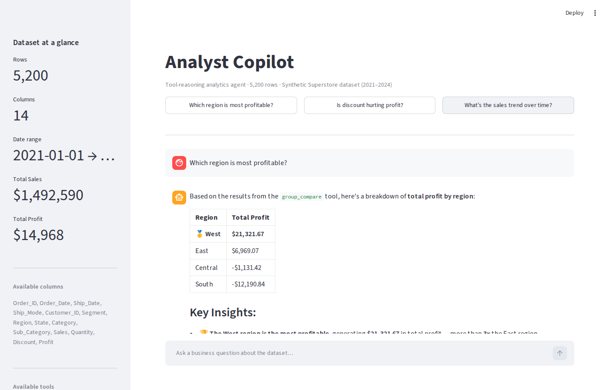

# Single-Agent Data Analytics

A production-grade ReAct analytics agent that answers plain-English business questions by reasoning over a curated set of typed analyst tools — not by writing arbitrary code.

The agent uses LangChain 1.x (LangGraph backend) with Anthropic's Claude as the LLM, binding a fixed toolbox of seven pandas operations via Anthropic's native tool-use API. Every tool call is logged in real time and rendered as a transparent reasoning trace in the Streamlit UI.

---

## How it works

### The ReAct loop

The agent implements the Reason + Act pattern. At each step the LLM decides whether to call a tool or emit a final answer:

```
Observation_0 = question
while not done:
    Thought_t  = LLM(system_prompt, history, Observation_{t-1})
    if Thought_t contains tool_call:
        Observation_t = tool(Thought_t.args)
    else:
        Answer = Thought_t
        break
```

Formally, the policy is:

$$\pi_\theta(a_t \mid s_t) = P_{\text{LLM}}\!\left(a_t \;\middle|\; \underbrace{[q, (a_1, o_1), \ldots, (a_{t-1}, o_{t-1})]}_{\text{context window}}\right)$$

where $a_t \in \{\text{tool\_call}(f, \mathbf{x}),\; \text{final\_answer}\}$ and $o_t = f(\mathbf{x})$ is the tool's structured return value.

### Why a fixed toolbox instead of free code generation

A "write any pandas you want" agent is unpredictable and hard to audit. Binding the agent to a curated primitive set gives:

- **Reliability**: each primitive is unit-testable; no hallucinated DataFrame operations.
- **Legibility**: the reasoning trace shows exactly which operations ran and with what arguments.
- **Composability**: complex questions decompose into sequences of primitives (e.g. `filter_count` then `group_compare` then `correlate`).

This is a more production-credible pattern than unconstrained code generation.

### Tool architecture

Each of the seven tools is a `@tool`-decorated Python function (LangChain `langchain_core.tools.tool`). The decorator auto-generates the JSON schema Anthropic requires for tool binding. Tools return plain text for the LLM to reason over, and register any generated Matplotlib figure in a module-level store that the Streamlit UI reads after the agent finishes.

```
Tool interface
──────────────
Input:   typed Python arguments (validated by LangChain)
Output:  str  <- agent sees this for reasoning
Side-fx: figures appended to _figures[]  <- UI reads this out-of-band
```

The LLM never sees raw figure bytes; figures flow out-of-band. This sidesteps context-window bloat and keeps the agent's reasoning purely over text.

### Anthropic tool-use API mapping

LangChain's `ChatAnthropic.bind_tools()` converts each `@tool` into Anthropic's `tools` block:

```json
{
  "name": "group_compare",
  "description": "Compute an aggregated metric grouped by a categorical column ...",
  "input_schema": {
    "type": "object",
    "properties": {
      "metric_column": {"type": "string"},
      "group_by_column": {"type": "string"},
      "agg": {"type": "string"}
    },
    "required": ["metric_column", "group_by_column", "agg"]
  }
}
```

The agent loop runs inside a LangGraph `CompiledStateGraph` (`langchain.agents.create_agent`), which handles multi-turn message threading automatically.

### Toolbox

| Tool | Description | Output |
|------|-------------|--------|
| `describe_dataset()` | Shape, dtypes, missingness summary | Text table |
| `investigate_distribution(column)` | Summary stats + histogram/value counts | Text + chart |
| `group_compare(metric, group_by, agg)` | Aggregated metric by category | Text + bar chart |
| `correlate(col_a, col_b)` | Pearson r, OLS slope, scatter | Text + scatter |
| `top_n(column, n, by)` | Top-N rows ranked by column | Text + bar chart |
| `filter_count(column, op, value)` | Row count satisfying a predicate | Text |
| `trend_over_time(date, metric, freq)` | Time-aggregated trend | Text + line chart |

### Correlation tool — statistical note

The `correlate` tool computes Pearson $r$ and an OLS slope:

$$r = \frac{\sum_i (x_i - \bar{x})(y_i - \bar{y})}{\sqrt{\sum_i (x_i - \bar{x})^2 \sum_i (y_i - \bar{y})^2}}$$

$$\hat{\beta}_1 = \frac{\sum_i (x_i - \bar{x})(y_i - \bar{y})}{\sum_i (x_i - \bar{x})^2}$$

For the Discount to Profit relationship in this dataset, $r \approx -0.60$ and $\hat{\beta}_1 \approx -419$: a 10-percentage-point increase in discount is associated with approximately $42 lower profit per order.

---

## System design

```
+-----------------------------------------------------+
|                    Streamlit UI                      |
|  +----------+  +-----------+  +------------------+  |
|  | Chat I/O |  |  Charts   |  |  Tool Trace      |  |
|  |          |  | (PNG bytes|  |  (expandable)    |  |
|  +----+-----+  +-----^-----+  +--------^---------+  |
|       |              |                 |             |
|       v              |                 |             |
|  +--------------------------------------------+     |
|  |           src/agent.py                     |     |
|  |   LangGraph CompiledStateGraph             |     |
|  |   +-------------+  +-----------+           |     |
|  |   | ChatAnthropic|  | ToolTracer|           |     |
|  |   |  (Claude)    |  | Callback  +-----------+     |
|  |   +------+-------+  +-----------+           |     |
|  |          | tool_use / tool_result            |     |
|  |          v                                   |     |
|  |   +------------------------------------------+|    |
|  |   |             src/tools.py                ||    |
|  |   |  7 @tool functions over pandas DataFrame||    |
|  |   |  -> str result (to LLM)                 ||    |
|  |   |  -> PNG bytes (to _figures[], to UI)     ||    |
|  |   +------------------------------------------+|    |
|  +---------------------------------------------+     |
+-----------------------------------------------------+
        |
        v
   data/superstore.csv  (synthetic, 5,200 rows)
```

Data flows: user question -> LangGraph runs ReAct loop -> tools execute pandas operations -> text results fed back to LLM -> LLM synthesizes answer -> Streamlit renders answer + figures + trace.

---

## Screenshots

**App home with example question buttons**


**Answered: "Which region is most profitable?" with inline profit-by-region chart**


**Tools-used trace panel expanded — showing the exact calls and arguments**


**Answered: "Is discount hurting profit?" — correlation chart and analysis**


**Answered: "What's the sales trend over time?" — monthly time-series chart**



---

## Dataset

Synthetic "Superstore" dataset generated by `src/data_gen.py` (5,200 orders, 2021-2024). Designed with realistic patterns:

- **West** region most profitable; **South** negative overall.
- **Technology** highest margins (~26%); **Furniture** thin margins severely eroded by discounts.
- **Q4 seasonality** baked into the date distribution.
- High discounts (>=0.3) produce negative-profit orders for Furniture.
- Discount to Profit Pearson $r \approx -0.60$.

Synthetic origin is noted here and visible in the app's sidebar.

---

## Run it

```bash
git clone https://github.com/BillKladis/Single-Agent-Data-Analytics
cd Single-Agent-Data-Analytics
pip install -r requirements.txt
# Add your key:
echo "ANTHROPIC_API_KEY=sk-ant-..." > .env
streamlit run app.py
```

The dataset generates automatically on first run if `data/superstore.csv` is missing.

---

## Design choices and limitations

The fixed-toolbox pattern is the deliberate constraint: the agent cannot write arbitrary pandas, which bounds risk but also bounds capability. Questions that do not decompose into the seven primitives will receive approximate or incomplete answers. The tools cover roughly 90% of common descriptive-analytics questions (distribution, comparison, correlation, ranking, filtering, trend) but not joins, multi-table queries, or inferential statistics. The LangGraph agent loop is stateless per query: there is no memory across conversations, so each question starts fresh. Figures are passed out-of-band via a module-level list, which is not thread-safe under concurrent users; for production use, a per-session store keyed by Streamlit session ID would be required.
