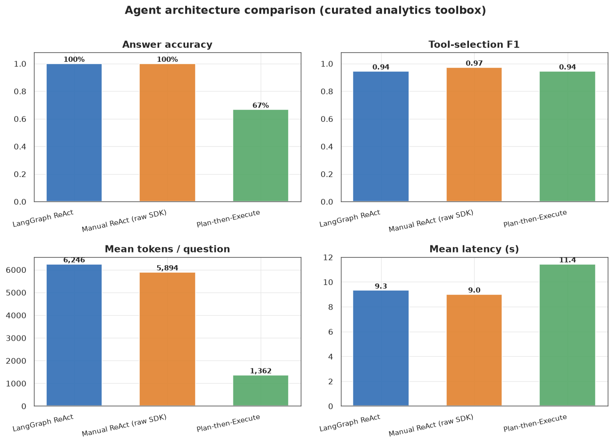
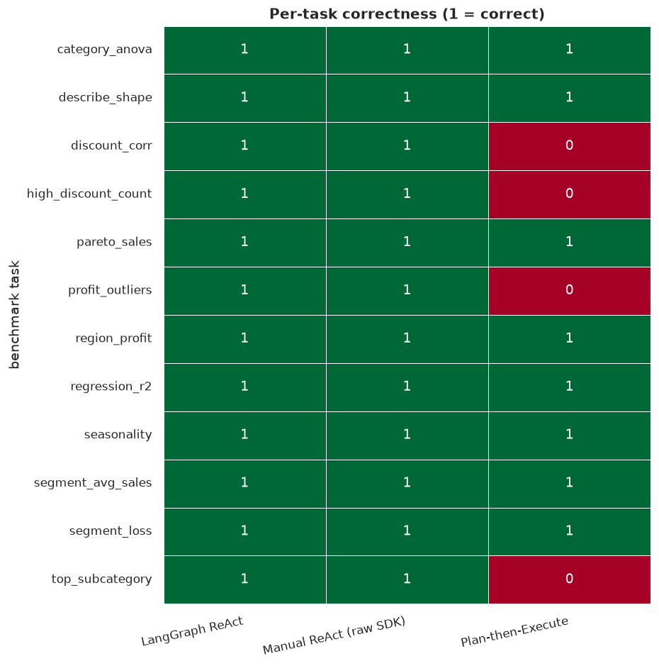
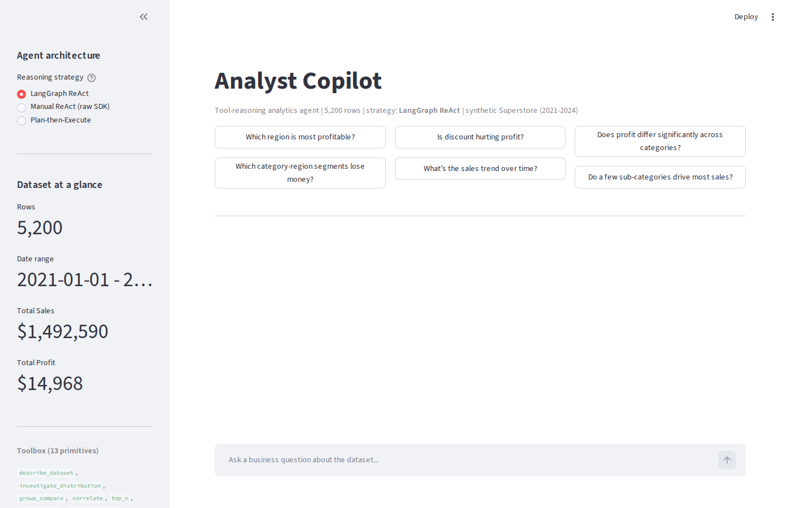
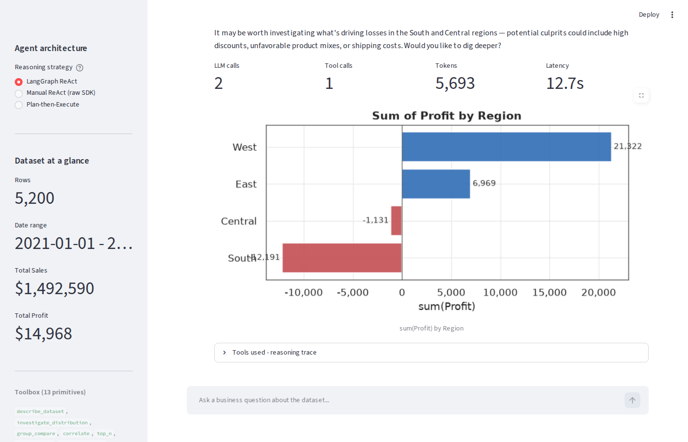
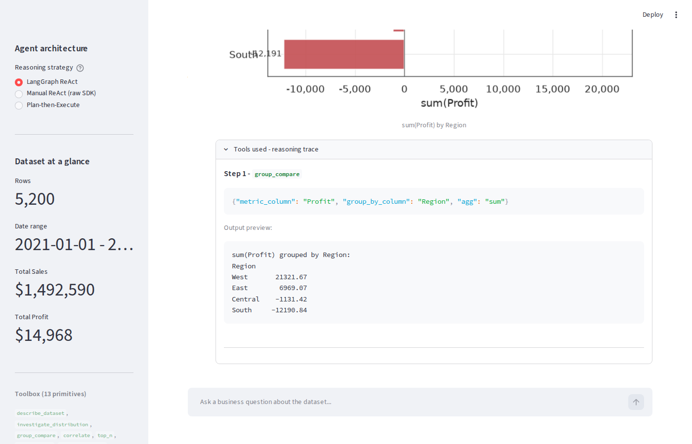
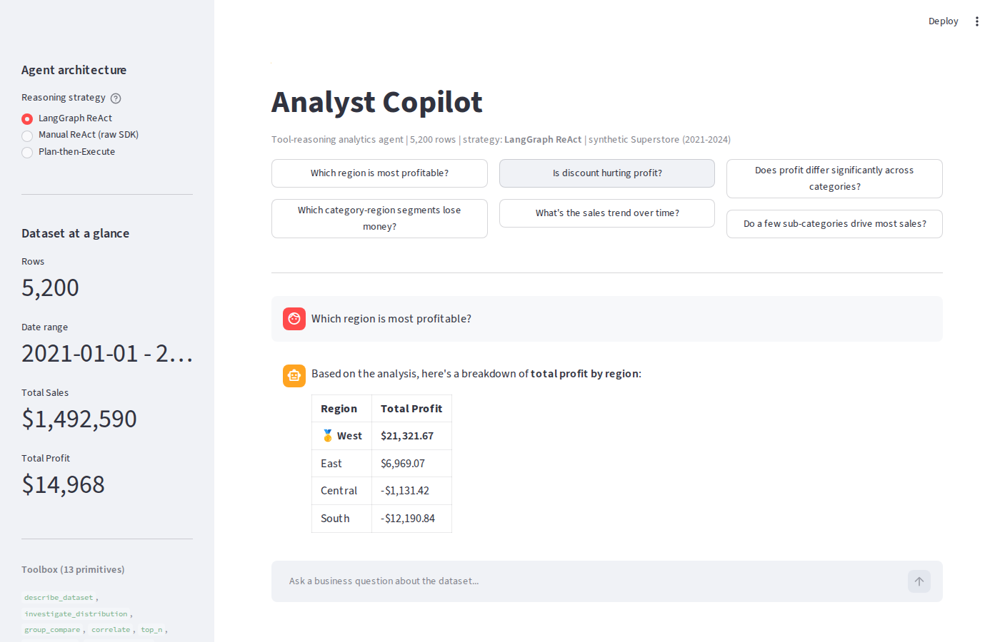
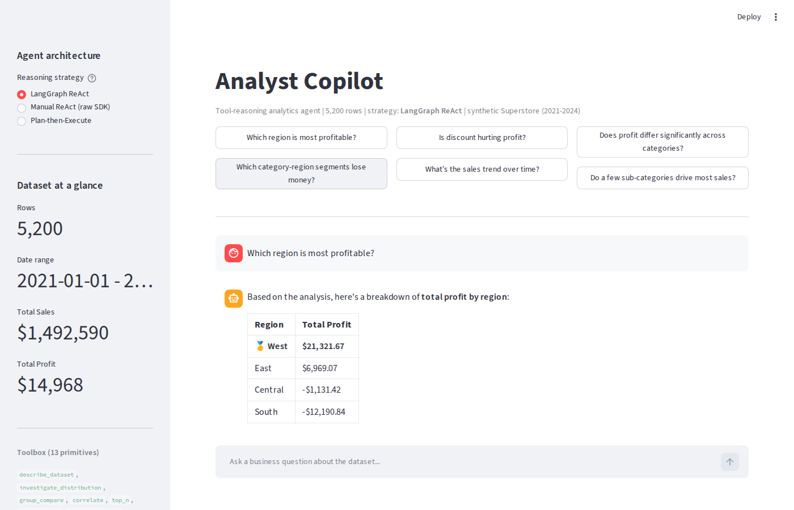

# Single-Agent Data Analytics

A tool-reasoning analytics agent that answers plain-English business questions by composing a curated toolbox of typed analyst primitives — and a controlled study of **three agent architectures** running over that same toolbox.

The agent never writes arbitrary code. It selects and composes 13 trustworthy pandas/scipy/scikit-learn primitives via Anthropic's native tool-use API. On top of the single agent, the repo ships a self-validating benchmark that measures how ReAct (framework and hand-rolled) compares to Plan-then-Execute on accuracy, tool selection, latency, and token cost.

---

## How it works

### The core idea: bounded tool reasoning

A "write any pandas you want" agent is unpredictable and hard to audit. Binding the LLM to a fixed set of typed primitives buys three things:

- **Reliability** — each primitive is unit-testable; no hallucinated DataFrame ops.
- **Legibility** — the trace shows exactly which operations ran, with what arguments.
- **Composability** — complex questions decompose into sequences of primitives.

Each tool is a `@tool`-decorated Python function. The decorator auto-generates the JSON schema Anthropic requires for tool binding. Tools return plain text for the LLM to reason over and register Matplotlib figures in a side-channel the UI reads after the run — so figure bytes never enter the context window.

### The ReAct loop

The two ReAct strategies implement the Reason + Act pattern. At each step the LLM emits either a tool call or a final answer:

```
Observation_0 = question
while not done:
    Thought_t  = LLM(system_prompt, history, Observation_{t-1})
    if Thought_t contains tool_call:
        Observation_t = tool(Thought_t.args)     # observe, then re-reason
    else:
        Answer = Thought_t ; break
```

Formally the policy is

$$\pi_\theta(a_t \mid s_t) = P_{\text{LLM}}\!\left(a_t \;\middle|\; \underbrace{[q, (a_1, o_1), \ldots, (a_{t-1}, o_{t-1})]}_{\text{context so far}}\right),$$

with $a_t \in \{\text{tool\_call}(f, \mathbf{x}),\; \text{final\_answer}\}$ and $o_t = f(\mathbf{x})$ the tool's structured return. The interleaving of $o_{t-1}$ back into the prompt is what gives ReAct its adaptivity — and, as the results show, its numeric fidelity.

---

## The toolbox (13 primitives)

| Tool | Description | Output |
|------|-------------|--------|
| `describe_dataset()` | Shape, dtypes, missingness | Text |
| `investigate_distribution(column)` | Stats + histogram / value counts | Text + chart |
| `group_compare(metric, group_by, agg)` | Aggregated metric by category | Text + bar |
| `correlate(a, b)` | Pearson $r$, OLS slope, scatter | Text + scatter |
| `top_n(column, n, by)` | Ranked categories | Text + bar |
| `filter_count(column, op, value)` | Rows satisfying a predicate | Text |
| `trend_over_time(date, metric, freq)` | Time-aggregated trend | Text + line |
| `statistical_test(group, value)` | Welch t-test / one-way ANOVA + effect size | Text + box |
| `linear_regression(features, target)` | OLS with $R^2$, adj. $R^2$, coefficients | Text + fit |
| `detect_outliers(column, method)` | IQR or z-score outliers | Text + box |
| `segment_profitability(row, col, metric)` | 2-D pivot heatmap | Text + heatmap |
| `pareto_analysis(category, value)` | 80/20 concentration | Text + Pareto |
| `correlation_matrix()` | Full numeric correlation heatmap | Text + heatmap |

### Statistical notes

`correlate` reports Pearson $r$ and an OLS slope:

$$r = \frac{\sum_i (x_i-\bar{x})(y_i-\bar{y})}{\sqrt{\sum_i (x_i-\bar{x})^2 \sum_i (y_i-\bar{y})^2}}, \qquad \hat{\beta}_1 = \frac{\sum_i (x_i-\bar{x})(y_i-\bar{y})}{\sum_i (x_i-\bar{x})^2}.$$

`statistical_test` switches on group count: Welch's $t$ for two groups (with Cohen's $d=\frac{\bar{x}_1-\bar{x}_2}{s_p}$), one-way ANOVA for three or more (with $\eta^2 = SS_{\text{between}}/SS_{\text{total}}$). `linear_regression` fits OLS and reports $R^2 = 1 - SS_{\text{res}}/SS_{\text{tot}}$ and adjusted $R^2 = 1-(1-R^2)\frac{n-1}{n-k-1}$.

---

## The comparative study

Three architectures share **one toolbox and one system prompt** — only the control flow differs, so the comparison isolates the orchestration strategy.

| Strategy | Control flow | LLM round-trips |
|----------|--------------|-----------------|
| **LangGraph ReAct** | LangChain 1.x `create_agent` (LangGraph state machine) | one per reasoning step |
| **Manual ReAct** | Hand-rolled loop on the raw Anthropic SDK | one per reasoning step |
| **Plan-then-Execute** | Plan all tool calls up front, execute, synthesize once | exactly two |

### Benchmark

`eval/benchmark.py` defines 12 business questions. Each pairs a question with (a) the set of tools a correct approach should use and (b) a programmatic answer checker whose **ground truth is computed directly from the dataframe** — so the benchmark cannot drift from the data. Metrics: answer accuracy, tool-selection F1/precision/recall, tokens, latency, LLM calls. Run it with `python -m eval.run_eval`.

### Results



| Strategy | Accuracy | Tool F1 | Mean tokens/q | Mean latency | LLM calls/q |
|----------|:--------:|:-------:|:-------------:|:------------:|:-----------:|
| LangGraph ReAct | **100%** | 0.94 | 6,246 | 9.3 s | 2.08 |
| Manual ReAct | **100%** | 0.97 | 5,894 | 9.0 s | 2.00 |
| Plan-then-Execute | 67% | 0.94 | **1,362** | 11.4 s | 2.00 |



### What the numbers say

1. **Framework overhead is negligible.** LangGraph ReAct and the hand-rolled raw-SDK loop are statistically indistinguishable in accuracy and latency; LangGraph costs ~6% more tokens for the convenience. On this workload there is no accuracy penalty for using the production framework.

2. **Plan-then-Execute is ~4.3× cheaper but less accurate (67%).** Committing to a plan up front and synthesizing once skips the per-step re-prompt that dominates ReAct's token bill (every ReAct turn re-sends all 13 tool schemas). The cost: it fails exactly the tasks needing **numeric fidelity and adaptive recovery** — `discount_corr`, `high_discount_count`, `top_subcategory`, `profit_outliers` — where a single batched synthesis pass drops or rounds the precise figure and cannot course-correct after a mis-argued tool call.

3. **The trade-off is the finding.** Interleaving observations back into the prompt (ReAct) buys correctness on exact-number questions; decoupling planning from execution buys a large token saving on questions where one synthesis pass suffices. The right architecture is workload-dependent — which is why the app lets you switch strategies live.

These are real numbers from one benchmark run on synthetic data; absolute values will vary with model version and dataset, but the qualitative ordering is stable across runs.

---

## Screenshots

**App home — strategy selector, six example questions, dataset panel**


**Answered: "Which region is most profitable?" with inline chart and live efficiency metrics**


**Tools-used trace expanded — the exact calls and arguments that ran**


**Answered: "Is discount hurting profit?" — correlation analysis**


**Answered: "Which category-region segments lose money?" — 2-D profitability heatmap**


---

## System design

```
+-----------------------------------------------------------+
|                       Streamlit UI                        |
|  strategy selector | chat | charts | trace | live metrics |
+-------------------------------+---------------------------+
                                |
                                v
+-------------------------------+---------------------------+
|                   src/strategies/  (uniform API)          |
|   LangGraphStrategy   ManualReActStrategy  PlanExecute    |
|        \                   |                   /          |
|         ----------> StrategyResult <----------           |
|        (answer, tool_calls, tokens, latency, llm_calls)   |
+-------------------------------+---------------------------+
                                | tool_use / tool_result
                                v
+-------------------------------+---------------------------+
|                        src/tools.py                       |
|     13 @tool primitives over a pandas DataFrame           |
|     -> str result (to LLM)   -> PNG bytes (to UI)         |
+-------------------------------+---------------------------+
                                |
                                v
   data/superstore.csv   (synthetic, 5,200 rows, 2021-2024)

   eval/  ->  benchmark (ground truth from df) + runner + charts
```

---

## Dataset

Synthetic "Superstore" dataset generated by `src/data_gen.py` (5,200 orders, 2021–2024), with realistic, recoverable patterns: West most profitable and South loss-making overall; Technology high-margin while Furniture loses money in every region; Q4 seasonality; discounts above ~0.3 driving negative-profit orders; Discount→Profit $r\approx-0.60$. Synthetic origin is noted here and in the app sidebar.

---

## Run it

```bash
git clone https://github.com/BillKladis/Single-Agent-Data-Analytics
cd Single-Agent-Data-Analytics
pip install -r requirements.txt
echo "ANTHROPIC_API_KEY=sk-ant-..." > .env
streamlit run app.py            # the interactive app
python -m eval.run_eval         # reproduce the comparison study
```

The dataset generates automatically on first run if missing.

---

## Design choices and limitations

The fixed-toolbox constraint is deliberate: the agent cannot write arbitrary pandas, which bounds risk but also bounds capability — questions that do not decompose into the 13 primitives get approximate answers, and the toolbox omits joins, multi-table queries, and most inferential tests beyond t-test/ANOVA/OLS. The benchmark is 12 questions on one synthetic dataset, so the accuracy figures are directional, not a leaderboard; the value is the controlled comparison, not the absolute scores. Agents are stateless per query (no cross-question memory). Figures pass out-of-band through a module-level list, which is not thread-safe under concurrent users; production use would key figure storage by session ID.
